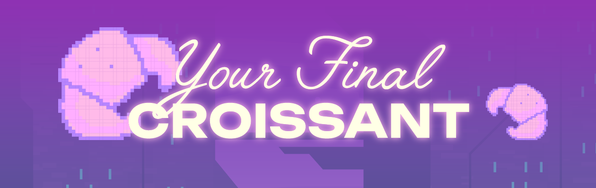
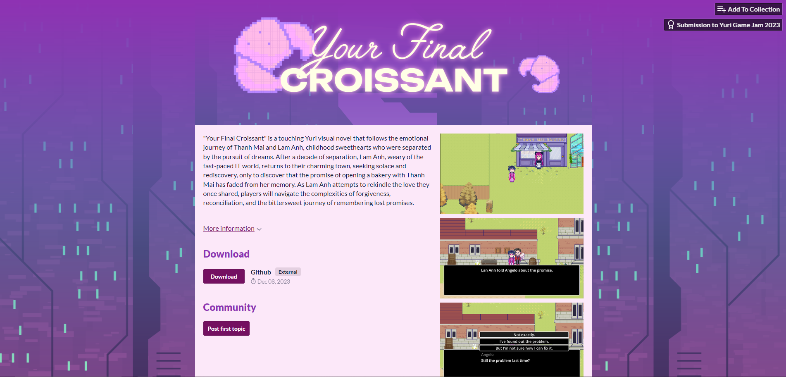

 

    

<h3 align="center">Indie Game: Your Final Croissant</h3>

  

    An indie RPG game exploring the journey of returning to your hometown and reconnecting after a stint in the big city workforce.
     
    <a href="https://phanhphanhphanh.itch.io/your-final-croissant">View Demo</a>
    ·
    <a href="https://forms.gle/jDcLwMfghXA5geiq6">Report Bug and Request Features</a>
  

<!-- ABOUT THE PROJECT -->

### About the Project

  

(<a href="#readme-top">back to top</a>)

### Built With

* [Godot.gd](https://godotengine.org/)

(<a href="#readme-top">back to top</a>)

<!-- GETTING STARTED -->
## Getting Started

1. First, install Godot to your device

2. Then, fork the repository
   
        git clone git@github.com:YOUR_USERNAME/Yuri.git

3. Open folders with Godot

4. Go to

        Test/title screen/title_screen.tscn

5. Play the title screen and start the game

## Contributors

Phuong Anh-Pham Doan
[@pdpa](https://github.com/PhuongAnh2212)

Khue Minh-Dao
[@dmk](https://github.com/KhueDao29)

Ha Chi-Le Thi
[@hachi](https://github.com/natsun08)

Dang Hoang-Tran Phuoc
[@tpdh](https://github.com/mnymkr)

